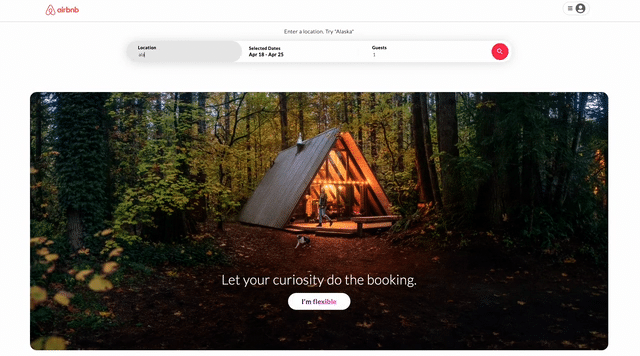
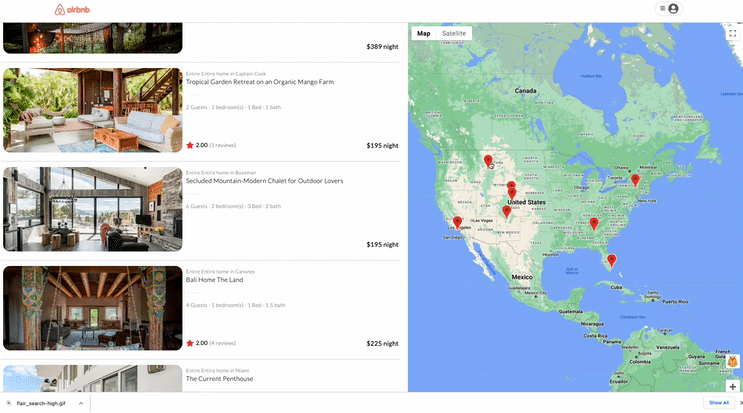
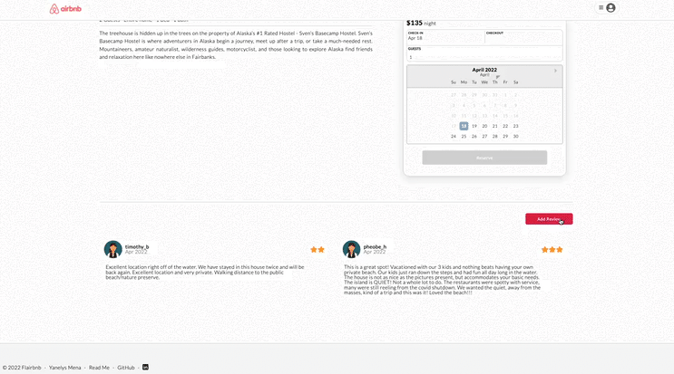
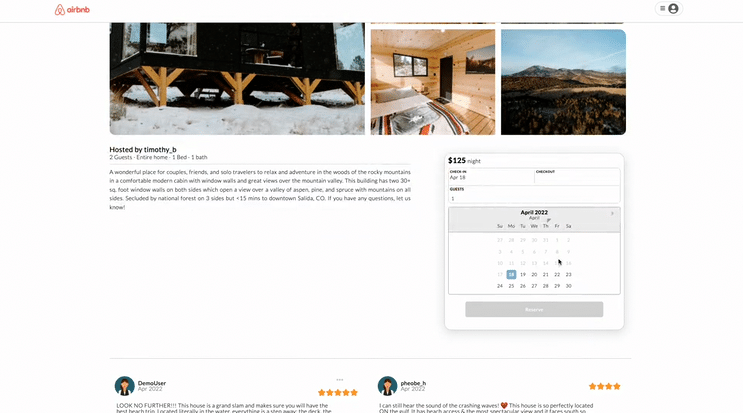

<div id="top"></div>

<a id="top"></a>
# Welcome to [FlairBnb](https://pinterest-clone-aa.herokuapp.com/), an Airbnb Clone!

Hosting Experiences, Booking Trips, Visualizing Locations on Google Maps, and Searching through eye-catching listings; these are some of the features available for users on Flairbnb. The app provides a clean and sharp user interface designed to put the user experience first. 

[Live Link](https://pinterest-clone-aa.herokuapp.com/)



[Click for a full list of features and upcoming releases.](#features)


## Wiki Links

 - [Database Schema](https://github.com/yanelys-mena/flairbnb/wiki/Wireframes-and-Front-End-Routes)
 - [Feature List](https://github.com/yanelys-mena/flairbnb/wiki/MVP-Feature-List)
- [Redux State Shade](https://github.com/yanelys-mena/pinterest-clone/wiki/Redux-State-Shape)

## Technologies

 - **Backend:** Node.js, Express
 - **Frontend:** JavaScript, React/Redux
 - **Database:** PostgresSQL
 - **Design and Styling:** HTML/CSS
 - **External APIs:** Google Maps API


<a id="features"></a>
## Features
* [Listings](#listings)
* [Reviews](#reviews)
* [Search listings](#search)
* [Book a Trip](#bookings)
    * [Make a Reservation](#bookings)
    * [View your Trips](#trips)
* [Google Maps](#maps)


* Future Releases
    * Geolocation


## Local Setup Instructions
* [Setup Instructions](#instructions)


# Features

<a id="google_maps"></a>
 ## Google Maps Pins and Previews 


-----------------------------

<a id="listings"></a>
## Listing and Listing Page

-----------------------------

<a id="reviews"></a>
## Reviews

-----------------------------

<a id="search"></a>
##  Search by availability, location, and guest number

-----------------------------

<a id="bookings"></a>
## Book Trips

-----------------------------


-----------------------------
 [Back to top](#top)

<a id="instructions"></a>
## Install Instructions

### Installation

1. Clone the repo
   ```sh
   git clone https://github.com/yanelys-mena/flairbnb.git
   ```

2. Install dependencies from the root directory.
    ```sh
    cd frontend > npm install
    ```
    ```sh
    cd backend > npm install
    ```

3. Create a POSTGRESQL user with CREATEDB and PASSWORD in PSQL.
    ```sh
      CREATE USER <name> WITH CREATEDB PASSWORD <'password'>
    ```

4. Create a .env file base on the .env.example given in the backend folder

5. Enter your username and password information into you .env file along with your desired database name, a secured combination of characters for your JWT_SECRET, and your desired PORT (preferably 5000).

6. Add the following proxy to your package.json file with your front end directory, replacing or keeping the 5000 port to match your PORT configuration found in your .env file.
    ```sh
      "proxy": "http://localhost:5000"
    ```

7. Create Database, Migrate, and Seed models.
    ```sh
      npx dotenv sequelize db:create
    ```
    ```sh
      npx dotenv sequelize db:migrate
    ```
    ```sh
      npx dotenv sequelize db:seed:all
    ```
8. Start the services in the back end directory.
    ```sh
      npm start
    ```
9. Start the services in the front end directory, which should open the project in your default broswer. If not naviagte to <a href="http://localhost:3000">http://localhost:3000</a>
    ```sh
      npm start
    ```


---------------------
 [Back to top](#top)


<!-- CONTACT -->
## Contact

Yanelys Mena - yanelyshm@outlook.com

Project Link: [https://github.com/yanelys-mena/flairbnb](https://github.com/github_username/flairbnb)

---------------------
 [Back to top](#top)

